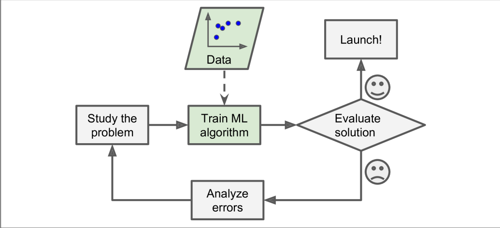
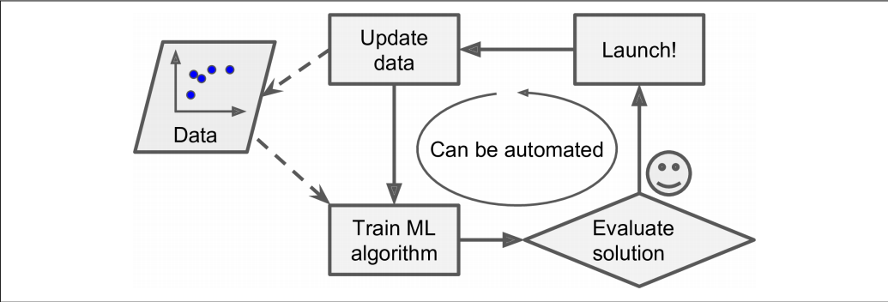
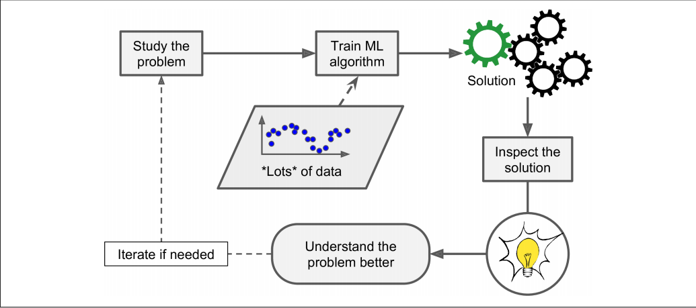

# What is Machine Learning?

**Machine Learning** is the science and art of programming computers so they can learn from data.

**By Arthur Samuel, 1959**

Machine learning is the field of study that gives computers the ability to learn without being explicitly programmed.

**By Tom Mitchell, 1997**

A computer program is said to learn from experience E with respect to some task T and some performance measure P, if its performance on T, as measured by P, improves with experience E.

# Why Machine Learning?

Consider how you would write a spam filter using traditional programming techniques (Figure 1-1):

1. First you would look at what spam typically looks like. You might notice that some words or phrases (such as “4U,” “credit card,” “free,” and “amazing”) tend to come up a lot in the subject. Perhaps you would also notice a few other patterns in the sender’s name, the email’s body, and so on.
2. You would write a detection algorithm for each of the patterns that you noticed, and your program would flag emails as spam if a number of these patterns are detected.
3. You would test your program, and repeat steps 1 and 2 until it is good enough.

Figure 1-1. The traditional approach

Since the problem is not trivial, your program will likely become a long list of complex rules—pretty hard to maintain.
In contrast, a spam filter based on Machine Learning techniques automatically learns which words and phrases are good predictors of spam by detecting unusually frequent patterns of words in the spam examples compared to the ham examples (Figure 1-2). The program is much shorter, easier to maintain, and most likely moreaccurate.

Figure 1-2. Machine Learning approach

Moreover, if spammers notice that all their emails containing “4U” are blocked, they might start writing “For U” instead. A spam filter using traditional programming techniques would need to be updated to flag “For U” emails. If spammers keep working around your spam filter, you will need to keep writing new rules forever.
In contrast, a spam filter based on Machine Learning techniques automatically notices that “For U” has become unusually frequent in spam flagged by users, and it starts flagging them without your intervention (Figure 1-3).

Figure 1-3. Automatically adapting to change

Another area where Machine Learning shines is for problems that either are too complex for traditional approaches or have no known algorithm. For example, consider speech recognition: say you want to start simple and write a program capable of distinguishing the words “one” and “two.” You might notice that the word “two” starts with a high-pitch sound (“T”), so you could hardcode an algorithm that measures high-pitch sound intensity and use that to distinguish ones and twos. Obviously this technique will not scale to thousands of words spoken by millions of very different people in noisy environments and in dozens of languages. The best solution (at least today) is to write an algorithm that learns by itself, given many example recordings for each word.

Finally, Machine Learning can help humans learn (Figure 1-4): ML algorithms can be inspected to see what they have learned (although for some algorithms this can be tricky). For instance, once the spam filter has been trained on enough spam, it can easily be inspected to reveal the list of words and combinations of words that it believes are the best predictors of spam. Sometimes this will reveal unsuspected correlations or new trends, and thereby lead to a better understanding of the problem.

Applying ML techniques to dig into large amounts of data can help discover patterns that were not immediately apparent. This is called **data mining**.

  

Figure 1-4. Machine Learning can help humans learn

To summarize, Machine Learning is great for:
• Problems for which existing solutions require a lot of hand-tuning or long lists of rules: one Machine Learning algorithm can often simplify code and perform better.
• Complex problems for which there is no good solution at all using a traditional approach: the best Machine Learning techniques can find a solution.
• Fluctuating environments: a Machine Learning system can adapt to new data.
• Getting insights about complex problems and large amounts of data.

# Types of Machine Learning : 
