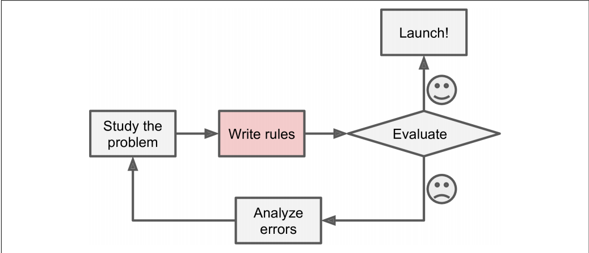
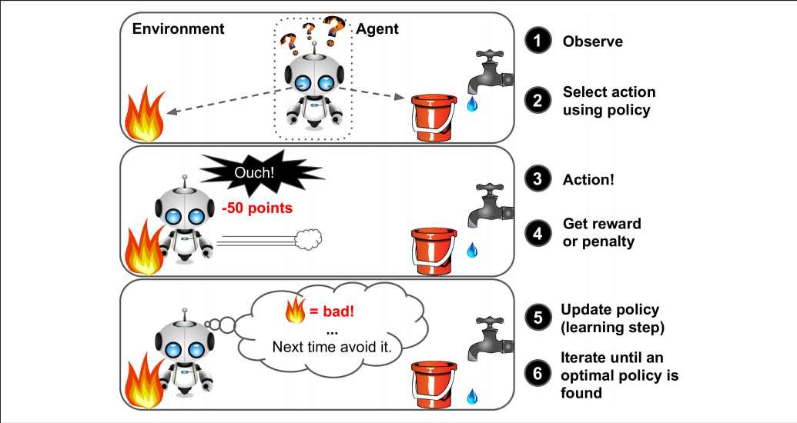

# What is Machine Learning?

**Machine Learning** is the science and art of programming computers so they can learn from data.

**By Arthur Samuel, 1959**

Machine learning is the field of study that gives computers the ability to learn without being explicitly programmed.

**By Tom Mitchell, 1997**

A computer program is said to learn from experience E with respect to some task T and some performance measure P, if its performance on T, as measured by P, improves with experience E.

# Why Machine Learning?

Consider how you would write a spam filter using traditional programming techniques (Figure 1-1):

1. First you would look at what spam typically looks like. You might notice that some words or phrases (such as “4U,” “credit card,” “free,” and “amazing”) tend to come up a lot in the subject. Perhaps you would also notice a few other patterns in the sender’s name, the email’s body, and so on.
2. You would write a detection algorithm for each of the patterns that you noticed, and your program would flag emails as spam if a number of these patterns are detected.
3. You would test your program, and repeat steps 1 and 2 until it is good enough.

Figure 1-1. The traditional approach

Since the problem is not trivial, your program will likely become a long list of complex rules—pretty hard to maintain.
In contrast, a spam filter based on Machine Learning techniques automatically learns which words and phrases are good predictors of spam by detecting unusually frequent patterns of words in the spam examples compared to the ham examples (Figure 1-2). The program is much shorter, easier to maintain, and most likely moreaccurate.

Figure 1-2. Machine Learning approach

Moreover, if spammers notice that all their emails containing “4U” are blocked, they might start writing “For U” instead. A spam filter using traditional programming techniques would need to be updated to flag “For U” emails. If spammers keep working around your spam filter, you will need to keep writing new rules forever.
In contrast, a spam filter based on Machine Learning techniques automatically notices that “For U” has become unusually frequent in spam flagged by users, and it starts flagging them without your intervention (Figure 1-3).

Figure 1-3. Automatically adapting to change

Another area where Machine Learning shines is for problems that either are too complex for traditional approaches or have no known algorithm. For example, consider speech recognition: say you want to start simple and write a program capable of distinguishing the words “one” and “two.” You might notice that the word “two” starts with a high-pitch sound (“T”), so you could hardcode an algorithm that measures high-pitch sound intensity and use that to distinguish ones and twos. Obviously this technique will not scale to thousands of words spoken by millions of very different people in noisy environments and in dozens of languages. The best solution (at least today) is to write an algorithm that learns by itself, given many example recordings for each word.

Finally, Machine Learning can help humans learn (Figure 1-4): ML algorithms can be inspected to see what they have learned (although for some algorithms this can be tricky). For instance, once the spam filter has been trained on enough spam, it can easily be inspected to reveal the list of words and combinations of words that it believes are the best predictors of spam. Sometimes this will reveal unsuspected correlations or new trends, and thereby lead to a better understanding of the problem.

Applying ML techniques to dig into large amounts of data can help discover patterns that were not immediately apparent. This is called **data mining**.

  

Figure 1-4. Machine Learning can help humans learn

To summarize, Machine Learning is great for:
• Problems for which existing solutions require a lot of hand-tuning or long lists of rules: one Machine Learning algorithm can often simplify code and perform better.
• Complex problems for which there is no good solution at all using a traditional approach: the best Machine Learning techniques can find a solution.
• Fluctuating environments: a Machine Learning system can adapt to new data.
• Getting insights about complex problems and large amounts of data.

# Types of Machine Learning : 

## Whether or not they are trained with human supervision
1. supervised
2. unsupervised
3. semisupervised
4. Reinforcement Learning
## Whether or not they can learn incrementally on the fly 
1. online learning
2. batch learning
## Whether they work by simply comparing new data points to known data points, or instead detect patterns in the training data and build a predictive model, much like scientists do 
1. instance-based learning
2. model-based learning

# Supervised Learning : 
In supervised learning, the training data you feed to the algorithm includes the desired solutions, called labels.
A typical supervised learning task is **classification**.

The spam filter is a good example of this: it is trained with many example emails along with their class (spam or ham), and it must learn how to classify new emails. 

Another typical task is to predict a target numeric value, such as the price of a car, given a set of features (mileage, age, brand, etc.) called predictors. This sort of task is called **regression** .

To train the system, you need to give it many examples of cars, including both their predictors and their labels

Here are some of the most important supervised learning algorithms:
1. k-Nearest Neighbors
2. Linear Regression
3. Logistic Regression
4. Support Vector Machines (SVMs)
5. Decision Trees and Random Forests
6. Neural networks

# Unsupervised Learning : 

In unsupervised learning, as you might guess, the training data is unlabeled.

For example, say you have a lot of data about your blog’s visitors. You may want to run a **clustering algorithm** to try to detect groups of similar visitors. 
At no point do you tell the algorithm which group a visitor belongs to: it finds those connections without your help. For example, it might notice that 40% of your visitors are males who love comic books and generally read your blog in the evening, while 20% are young sci-fi lovers who visit during the weekends, and so on. If you use a **hierarchical clustering algorithm**, it may also subdivide each group into smaller groups. This may help you target your posts for each group.

**Visualization algorithms** are also good examples of unsupervised learning algorithms: you feed them a lot of complex and unlabeled data, and they output a 2D or 3D representation of your data that can easily be plotted. These algorithms try to preserve as much structure as they can (e.g., trying to keep separate clusters in the input space from overlapping in the visualization), so you can understand how the data is organized and perhaps identify unsuspected patterns.

A related task is **dimensionality reduction**, in which the goal is to simplify the data without losing too much information. One way to do this is to merge several correlated features into one. For example, a car’s mileage may be very correlated with its age, so the dimensionality reduction algorithm will merge them into one feature that represents the car’s wear and tear. This is called feature extraction.

Another important unsupervised task is **anomaly detection**. For example, detecting unusual credit card transactions to prevent fraud, catching manufacturing defects, or automatically removing outliers from a dataset before feeding it to another learning algorithm. The system is shown mostly normal instances during training, so it learns to recognize them and when it sees a new instance it can tell whether it looks like a normal one or whether it is likely an anomaly. 

A very similar task is **novelty detection**: the difference is that novelty detection algorithms expect to see only normal data during training, while anomaly detection algorithms are usually more tolerant, they can often perform well even with a small percentage of outliers in the training set.

Another common unsupervised task is **association rule learning**, in which the goal is to dig into large amounts of data and discover interesting relations between attributes. For example, suppose you own a supermarket. Running an association rule on your sales logs may reveal that people who purchase barbecue sauce and potato chips also tend to buy steak. Thus, you may want to place these items close to each other.

Here are some of the most important unsupervised learning algorithms:
1. Clustering
    - K-Means
    - DBSCAN
    - Hierarchical Cluster Analysis (HCA)
2. Visualization and dimensionality reduction
    - Principal Component Analysis (PCA)
    - Kernel PCA
    - Locally-Linear Embedding (LLE)
    iv. t-distributed Stochastic Neighbor Embedding (t-SNE)
3. Anomaly detection and novelty detection
    - One-class SVM
    - Isolation Forest
4. Association rule learning
    - Apriori
    - Eclat

# Semi-supervised Learning : 

Some algorithms can deal with partially labeled training data, usually a lot of unlabeled data and a little bit of labeled data. This is called semisupervised learning.

Some photo-hosting services, such as Google Photos, are good examples of this. Once you upload all your family photos to the service, it automatically recognizes that the same person A shows up in photos 1, 5, and 11, while another person B shows up in photos 2, 5, and 7. This is the unsupervised part of the algorithm (clustering). Now all the system needs is for you to tell it who these people are. Just one label per person,4 and it is able to name everyone in every photo, which is useful for searching photos.

Most semisupervised learning algorithms are combinations of unsupervised and supervised algorithms. For example, **deep belief networks (DBNs)** are based on unsupervised components called **restricted Boltzmann machines (RBMs)** stacked on top of one another. RBMs are trained sequentially in an unsupervised manner, and then the whole system is fine-tuned using supervised learning techniques.

# Reinforcement Learning : 

Reinforcement Learning is a very different beast. The learning system, called an agent in this context, can observe the environment, select and perform actions, and get rewards in return (or penalties in the form of negative rewards). It must then learn by itself what is the best strategy, called a policy, to get the most reward over time. A policy defines what action the agent should choose when it is in a given situation.

Figure 1-5 Reinforcement Learning

# Batch Learning : 

In **batch learning**, the system is incapable of learning incrementally: it must be trained using all the available data. This will generally take a lot of time and computing resources, so it is typically done offline. First the system is trained, and then it is launched into production and runs without learning anymore; it just applies what it has learned. This is called **offline learning**.

# Online Learning : 

In **online learning**, you train the system incrementally by feeding it data instances sequentially, either individually or by small groups called mini-batches. Each learning step is fast and cheap, so the system can learn about new data on the fly, as it arrives.

# Instance-based Learning : 

The instance-based learning: the system learns the examples by heart, then generalizes to new cases by comparing them to the learned examples (or a subset of them), using a similarity measure.

# Model-based Learning : 

Another way to generalize from a set of examples is to build a model of these examples, then use that model to make predictions. This is called model-based learning

**Utility function (or fitness function)**: that measures how good your model is.

**Cost function**: that measures how bad your model is.
  
# Main Challenges of Machine Learning:

1. Insufficient Quantity of Training Data

2. Nonrepresentative Training Data

3. Poor-Quality Data
    - Obviously, if your training data is full of errors, outliers, and noise (e.g., due to poor-quality measurements), it will make it harder for the system to detect the underlying patterns, so your system is less likely to perform well.

4. Irrelevant Features
    -  A critical part of the success of a Machine Learning project is coming up with a good set of features to train on. This process, called feature engineering, involves:
        - Feature selection: selecting the most useful features to train on among existing features.
        - Feature extraction: combining existing features to produce a more useful one (as we saw earlier, dimensionality reduction algorithms can help).
        - Creating new features by gathering new data.

5. Overfitting the Training Data
    - Say you are visiting a foreign country and the taxi driver rips you off. You might be tempted to say that all taxi drivers in that country are thieves. Overgeneralizing is something that we humans do all too often, and unfortunately machines can fall into the same trap if we are not careful. In Machine Learning this is called **overfitting**: it means that the model performs well on the training data, but it does not generalize well.
    - Constraining a model to make it simpler and reduce the risk of overfitting is called **regularization**.
    - The amount of regularization to apply during learning can be controlled by a hyper‐parameter. A hyperparameter is a parameter of a learning algorithm (not of the model). As such, it is not affected by the learning algorithm itself; it must be set prior to training and remains constant during training. If you set the regularization hyper‐parameter to a very large value, you will get an almost flat model (a slope close to zero); the learning algorithm will almost certainly not overfit the training data, but it will be less likely to find a good solution.

6. Underfitting the Training Data
    - Underfitting is the opposite of overfitting: it occurs when your model is too simple to learn the underlying structure of the data.
    - The main options to fix this problem are:
        - Selecting a more powerful model, with more parameters
        - Feeding better features to the learning algorithm (feature engineering)
        - Reducing the constraints on the model (e.g., reducing the regularization hyper‐parameter)

# Testing and Validating:

